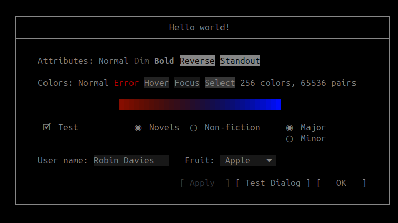

#### NWindows TUI Library
<!--[](https://github.com/rerdavies/nwindows) -->
[](https://opensource.org/licenses/MIT)
[](https://reravies.github.io/nwindows/documentation)
[](https://reravies.github.io/nwindows/examples)
<!--[](https://reravies.github.io/nwindows/) -->

INITIAL DEPLOYMENT IN PROGRESS. NOT YET READY FOR USE!!!

The *NWindows* library is a C++ text user interface (TUI) library for building console applications on Linux.
The library uses elements to compose user interfaces using an innovative and concise manipulator system. The library provides a rich set of elements with which to build user interfaces.

Built on top of the *ncursesw* library, *NWindows* works on both xterm and raw linux terminal windows, and also works over ssh.

&nbsp;&nbsp;

Here is a simple example of an *NWindows* application that demonstrates the use of NWindow's manipulator syntax to create users interfaces. The program creates a window with a button that closes the window when clicked:
        
```
#include "NWindows/NWindows.hpp"

using namespace nwindows;

int main(void) {
    NWindow::ptr window = NWindow::create(AUTO_SIZE, AUTO_SIZE);

    window
        | title("Hello")
        | add_child(
            NButtonElement::create("Hello world!")
            | margin({ 2,1,2,1 })
            | on_click([window](int button, NClickedEventArgs& event)
                {
                    event.handled = true;
                    event.window->close();
                }
            )
        );
    window->run();
}
```

which displays the following output when executed.

&nbsp;&nbsp;

See the [documentation](https://github.io/rerdavies/nwindows> for more information, and for instructions on installing, and using *NWindows*.
